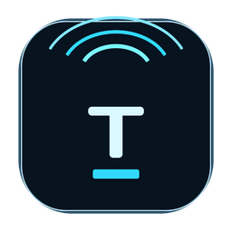

# EchoText

<p align="center">
  
</p>

<p align="center">
  Fast LAN pairing and two-way text transfer between Windows and Android.
</p>

<p align="center">
  <a href="https://img.shields.io/badge/Python-3.12-3776AB?logo=python&logoColor=white"></a>
  <a href="https://img.shields.io/badge/Android-API%2024%2B-34A853?logo=android&logoColor=white"></a>
  <a href="https://img.shields.io/badge/Platform-Windows%20%2B%20Android-0A84FF"></a>
  <a href="https://img.shields.io/badge/Dependencies-uv-7C3AED"></a>
  <a href="https://img.shields.io/badge/Lint-ruff-F1B722"></a>
</p>

<!-- README-I18N:START -->

[简体中文](./README.md) | **English**

<!-- README-I18N:END -->

> [!NOTE]
> EchoText is designed for trusted local networks such as home Wi-Fi, office LANs, or hotspot sharing. It is not an end-to-end encrypted internet messenger.

## Overview

- Windows desktop app: Python 3.12 + Kivy
- Android app: native Java + Android SDK
- Discovery: UDP broadcast on port `48734`
- Transport: HTTP `POST /api/v1/pair` and `POST /api/v1/messages`
- Integrity: per-peer HMAC-SHA256 signatures
- Clipboard workflow: paste, send, copy latest text, and optional foreground auto sync
- History: in-memory by default with optional local persistence
- Branding: one shared icon set for Android launcher assets, Windows EXE, the Kivy window, and the installer
- App language: both the desktop and Android apps now ship with a fixed Simplified Chinese UI and no in-app language switch

The current Android deliverable comes from the native project in [`android-app/`](/C:/Users/SoloEternity/Documents/Code/EchoText/android-app). The old Buildozer path remains only as legacy context and is no longer the recommended APK delivery route.

## Install

Use the packaged artifacts from `dist/`:

- Android: `EchoText-Android-v0.1.0-debug.apk`
- Windows: `EchoText-Setup-v0.1.0.exe`
- Source: `EchoText-source-v0.1.0.zip`

Keep both devices on the same LAN. The Windows installer automatically adds a `LocalSubnet` inbound rule for `EchoText.exe` on both Private and Public networks. If you run from source, still allow local network access when Windows prompts you.

## Pair and Send

1. Open EchoText on both devices.
2. Wait for the target device to appear in the device list.
3. Read the visible six-digit pair code on the target device.
4. Enter that code on the other device and press `Pair`.
5. Paste or type text, then press `Send`.
6. Received text is written to the history panel and can be copied back with one click.

Foreground auto sync mirrors clipboard changes only while the app remains open in the foreground. The current app UI is fixed to Simplified Chinese.

## Development

EchoText uses `uv` for project dependency management. A global `python` and `pip` should still exist on `PATH` for compatibility and diagnostics, but project dependencies should be managed through `uv`.

Repair or verify the Windows toolchain:

```powershell
.\scripts\repair_toolchain.ps1
```

Install dependencies and run checks:

```powershell
uv sync --group dev
uv run ruff format --check .
uv run ruff check .
uv run pytest
```

Run the Windows desktop app from source:

```powershell
uv run echotext
```

> [!TIP]
> This repository currently has no `.github` workflow, so the badges intentionally show static project metadata only, not CI status.

## Build

Generate the branding assets:

```powershell
uv run python scripts/generate_brand_assets.py
```

Create the source archive:

```powershell
.\scripts\package_source.ps1
```

Build the Windows app and installer:

```powershell
.\scripts\build_windows.ps1
```

Build the native Android APK with the local Android SDK:

```powershell
.\scripts\build_android_native.ps1
```

Run the full build flow:

```powershell
.\scripts\build_all.ps1
```

The Android build script looks for the SDK in this order:

- `ANDROID_SDK_ROOT`
- `ANDROID_HOME`
- `%LOCALAPPDATA%\Android\Sdk`

If you need a proxy, set `HTTP_PROXY` or `HTTPS_PROXY` before launching the Android build script. The script forwards those settings to Gradle.

## Packaging Outputs

Successful builds place these files in `dist/`:

- `EchoText-source-v0.1.0.zip`
- `EchoText-Android-v0.1.0-debug.apk`
- `EchoText-Setup-v0.1.0.exe`

## FAQ

- `python` opens the Microsoft Store or points to a dead shim:
  Run `.\scripts\repair_toolchain.ps1`.
- `pip` is missing from `PATH`:
  Reinstall or reset Scoop Python, then reopen PowerShell.
- `uv run` uses the wrong interpreter:
  Confirm `.python-version` is `3.12`, then run `uv sync --group dev`.
- Android build cannot find the SDK:
  Set `ANDROID_SDK_ROOT`, or install the SDK to `%LOCALAPPDATA%\Android\Sdk`.
- Devices do not appear:
  Make sure both devices are on the same Wi-Fi and that local broadcast traffic is not blocked. After upgrading, reopen both apps once so they can rebroadcast to `255.255.255.255` and the active subnet broadcast target.
- Pairing fails:
  Re-read the target six-digit pair code; codes expire after five minutes. If the Windows app is launched from source, also confirm Windows Defender Firewall allows the current process to access the local subnet.
- Android can receive from Windows but cannot send back:
  Upgrade both apps to the latest build, reopen both sides once so they republish the preferred LAN transport port, and re-pair if stale peer state is still cached.
- Windows Chinese text still renders incorrectly:
  Install a common Chinese system font such as Microsoft YaHei, DengXian, SimHei, or Noto Sans SC, then restart EchoText.
